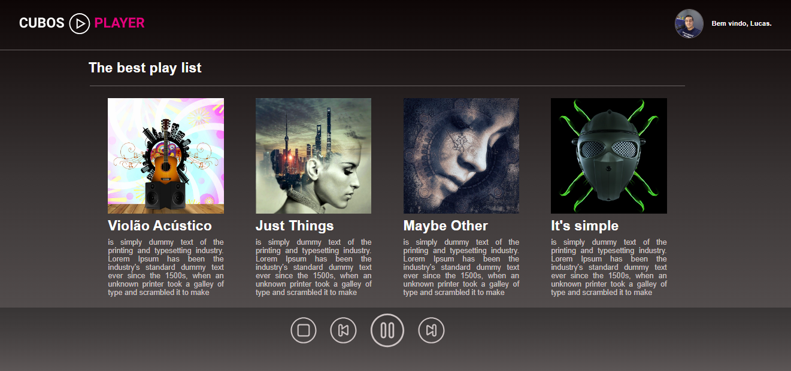
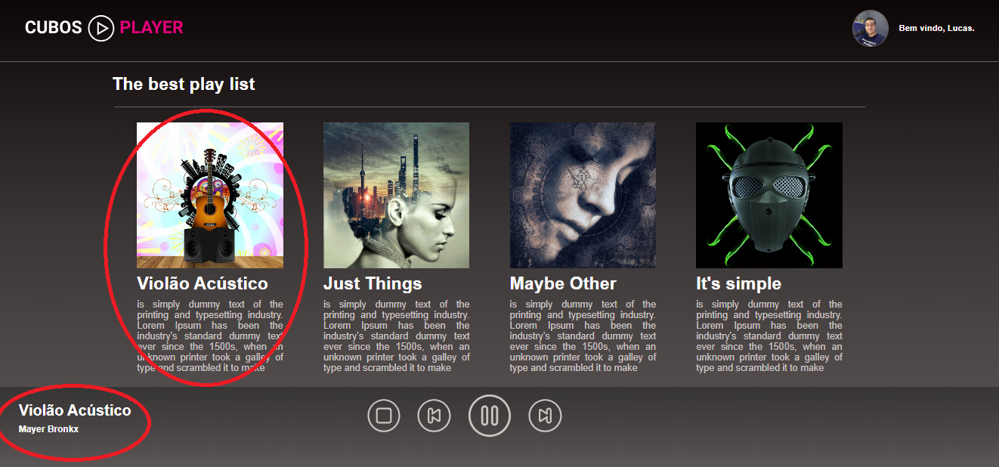
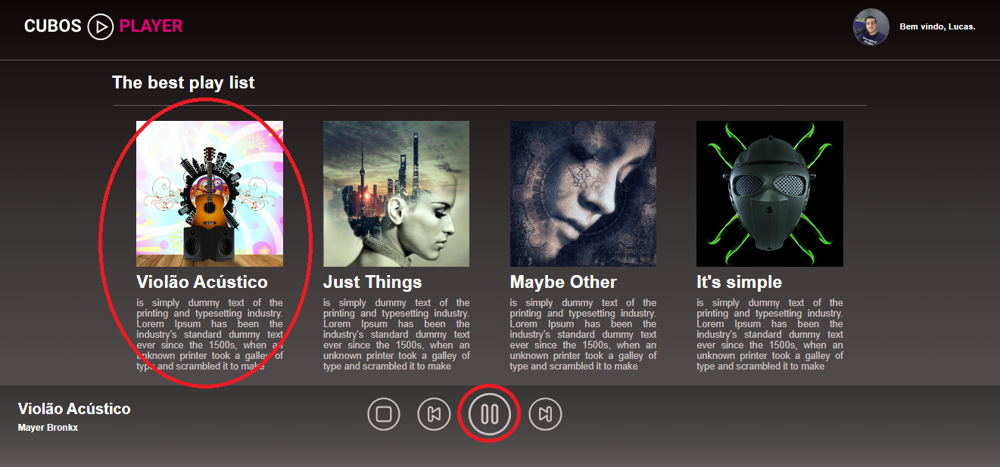

<h1 style="color:blue;"> Player de Músicas</h1>

<h2>Olá meu nome é Lucas esse é meu primeiro projeto que foi um desafio do curso Cubos Academy e cada vez que aprender 
algo irei adicionar mais funcionalidades </h2>

<strong>Print do Projeto:

<h2>A única funcionalidade que esse projeto possui é quando você clica em uma das capas das músicas o nome
    da música e nome do artista aparece na parte de baixo do player como mostra a imagem abaixo:</h2>

<h2>Funcionalidade adicionada de quando você clica na capa da música a música clicada será tocada e o botão de pausar a 
música vai aparecer e se clicar no botão de pause o de play ira aparecer</h2>

<h2> E botão de stop alem de parar a música reseta ela támbem</h2>

<h2>E finalizando esse README vou falar como executar você terá que clonar para seu pc, abra o prompt de comando, vá até o diretório onde o projeto está localizado e de npm start isso tudo pelo cmd</h2>
